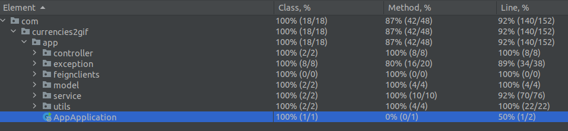

# Тестовое задание от Альфа Банка

## Как запустить

**Prerequisites**  
Docker (проверено с version 20.10.16) и docker-compose (проверенно с version 1.29.2)  

    git clone https://github.com/Rustykik/AlfaBank_java && cd AlfaBank_java
    docker-compose up --build -d

В браузере http://localhost/

---

или  собрать Backend отдельно  

**Prerequisites**  
Gradle (проверено с 7.4.2),
openjdk (проверенно с version "11.0.15" 2022-04-19)  

Запустить тесты  

    gradle test

Запустить Backend

    gradle clean build
    java -jar build/libs/app-0.0.1-SNAPSHOT.jar 

## Что это

---
Это задание предполагало создание небольшого сервиса, который обращается к сервису курсов валют, и отображает gif:
* если курс по отношению к USD за сегодня стал выше вчерашнего, то отдаем рандомную отсюда https://giphy.com/search/rich
  

* если ниже - отсюда https://giphy.com/search/broke

Ссылки:  
REST API курсов валют - https://docs.openexchangerates.org/  
REST API гифок - https://developers.giphy.com/docs/api#quick-start-guide


## Backend 
Написан на Java SpringBoot 2.  
Сборка осуществляется при помощи Gradle.  
Для взаимодействия с внешними сервисами используется Feign.  
Сервис покрыт тестами на JUnit 5 (assertj), для Feign-клиентов создавались @MockBean, на контроллер, с использованием MockMVC  были написаны Unit-тесты с моками, и интеграционные тесты, проверяющие корректность работы всех частей Backend'a.  



## Configure
Параметры - валюта по отношению к которой смотрится курс, адреса внешних сервисов, ключи приложений вынесены в application.yml
```yml
feign:
  clients:
    currency:
      name: "currency"
      url: "https://openexchangerates.org/api/"
      app_id: "3009f7558066428f83561e07c8c8309c"
      base: "USD"
    gif:
      name: "gif"
      api_key: "fhsUcYw0isYtS7ftAiPcOs7XOFlyTrtP"
      url: "https://api.giphy.com/v1/"
```

## REST API

    api/v1/currencies/{CUR}/latest GET request

**Responses**:

Status|Result
---|-----
200| Decimal number (for example 0.799584)
400| You entered not valid currency request, please check that {CUR} is in the list of available currencies. If you are sure that you entered valid info please contact the support.
500| Third party API is not available at the moment.
    api/v1/currencies/{CUR}/yesterday GET request
**Responses**:

Status|Result
---|-----
200| Decimal number (for example 0.799584)
400| We may not have {CUR} rates on yesterday or you entered invalid currency request, please check that {CUR} is in the list of available currencies. If you are sure that you entered valid info please contact the support.
500| Third party API is not available at the moment.


    api/v1/gifs/random GET request requiers param "tag"

**Responses**:

Status|Result
---|-----
200| Gif link, for example```json {"url":"https://i.giphy.com/MFJPimi32jUk7KbJyb.gif"}```
500| Third party API is not available at the moment.

## Frontend

HTML/CSS со скриптом на JS, который запрашивает данные из REST API  endpoint'ов и на основе полученных результатов отображает GIF 

## Архитектура


## Screenshots


